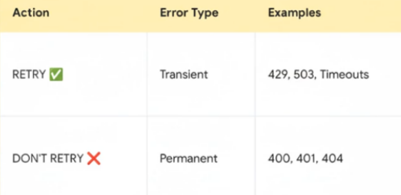

# Retry considerations

### 1. Is a retry really helpful?

All right. Now, for the main event, **you've got to know when to even bother retrying**. Seriously, you don't want your system just spinning its
wheels, wasting time and resources trying to fix something that is permanently broken. And this table here just lays it all out perfectly.

  

Look, we only want to retry transient issues. You know, temporary glitches, network hiccups, a 503 service unavailable. That's a perfect example.
The servers just saying, "Hey, I'm swamped right now. Come back in a bit." So, yeah, trying again makes total sense. But on the flip side, we have
permanent errors. Things like a 400 bad request. That means we sent something wrong. Retrying that over and over, it's just going to fail every single time.

### 2. Going asynchronous

This is all about protecting two things. The user experience and your own systems resources.
By shifting all this retry logic into a background job like with Queueable Apex, the user is completely unaware. They're not stuck watching a loading spinner.
And here's the best part, the big bonus. We get access to way higher governor limits, which gives our process so much more breathing room to actually get the job done right.

### 3. Timing

It's not enough to just retry. You have to retry smart. Instead of just, hammering the external system over and over the second it fails, which can actually make things worse, we need to be a little more 'polite'. And that's where something called exponential backoff comes in. Fancy term for a simple idea. After the first attempt fails, we wait, let's say, 5 seconds.
If it fails again, we wait longer, maybe 15 seconds, then 30. We're giving the other system progressively more and more time to recover.
It's a really respectful and super effective way to deal with things like rate limiting or temporary server overloads.

### 4. Limit your retries

This one is simple, but absolutely vital.
Just pick a reasonable number, like 3 to 5 attempts, and that's it. This is your safety valve.
It's what stops you from getting stuck in an infinite loop that consumes all your resources trying to hit a service that might be down for hours.

### 5. State management

You got to keep track of the original data and how many times you've tried.\
If everything goes down, it is important to have the last state persisted somewhere, in order to recover properly.

### 6. Tasks idempotency

Additionally, keeping track of tasks **idempotency** is crucial.\
You don't want to fire the same order request twice and have duplicate orders at the end.

### 7. Logging and monitoring

I mean, log everything, every attempt, every success, every failure.\
This will help you when it's time to debug.\
It also serves traceability, reporting, analyitics and failure alerting for misbehaving integrations.

### 8. Plan for total failure

What happens when the maximum retries count have been reached and the operation behind the task still didn't work?\
Do you email an admin, update a record? You absolutely have to have a plan for this final failure scenario.

## Good for now

So, that's to the ideas.\
Now that we have some key aspects for consideration when build our framework, let's try to implement them in a flexible, configurable and extensible fashion, so that it can easily be applied in real world scenarios. 

[<< BACK](../README.md)
