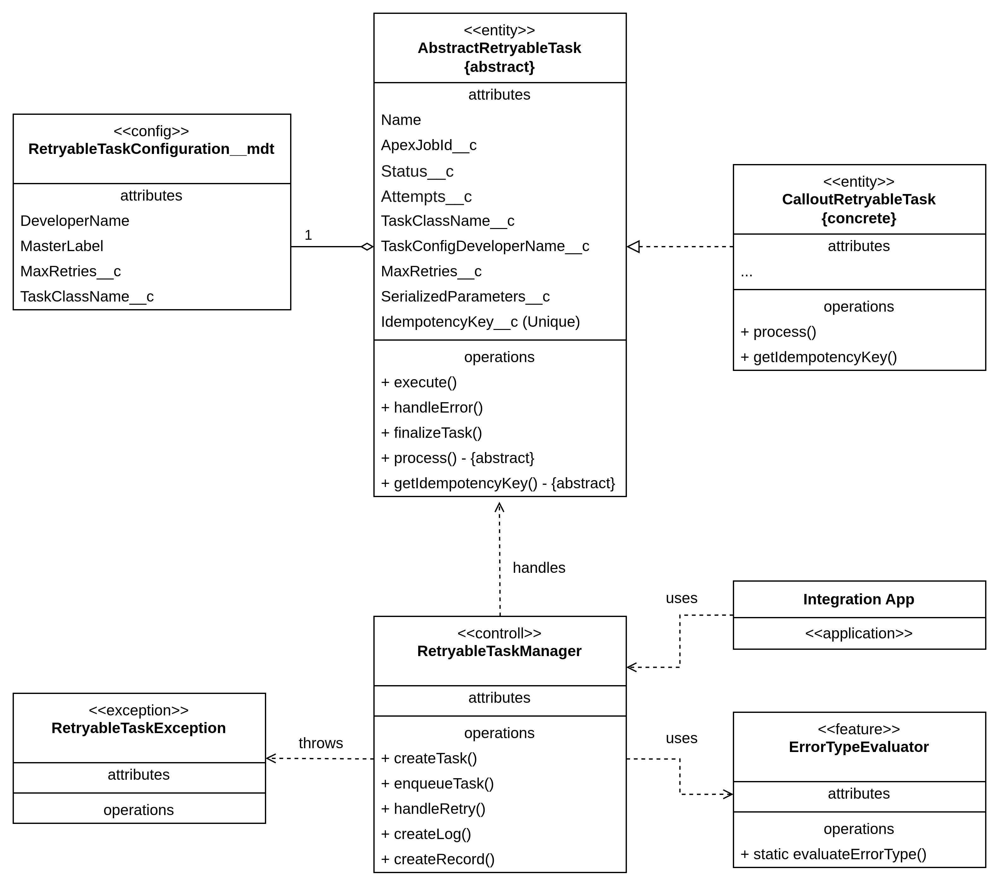
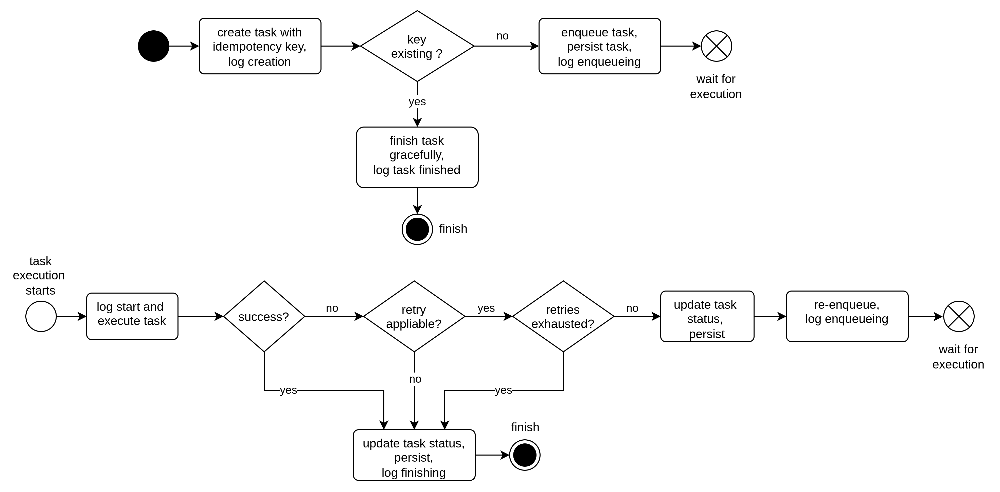

## Solution Proposal

When thinking of a framework for handling async retriable integration tasks, I imagine having some software components I can reuse for doing the same thing over and over again, but for different and specific use cases.\
Here are some use cases I can think of now:

- Sending a flight booking batch update request to an external system.
- Sending a quotation request to an external system with some product and customer data.
- Sending a batch product reservation request to an external warehouse system and saving the confirmation response locally.

Generally speaking it would look like this:

  

- **Integration Application**: Is the application where we are creating and firing the integrations tasks.
- **Concrete Task**:
    - Is the Apex class instance implementing the real integration task execution.
    - It contains an instance of the Task Configuration.
    - It extends some basic functionallity defined in the Abstract Task class.
- **Task Configuration**: it defines some configurations for the the task, like:
    - class name to be instentiated when creating a new concrete task.
    - retry max amount
    - configuration name to be referenced in the integration application.
- **Task Manager**: Is a class responsible for:
    - creating new concrete task instances by their configuration name.
    - enqueuing the tasks to be executed.
    - handling retry on task execution errors.

Let's imagine we are going to implement a solution for the use case:

> _Sending a quotation request to an external system with some product and customer data_

In order to simplify, here is what I am expecting from the framework:

- I define a concrete class implementation (e.g. `QuoteRequestRetryableTask`) to be instantiated by the framework when I call a `createTask` method.
- I define a Custom Metadata Type record for holding the configurations for my concrete tasks `AsyncRetryableTaskConfiguration__mdt` with `DeveloperName` = 'QuoteRequestRetryableTask'.
- By calling `createTask` on the Task Manager, I give the defined `DeveloperName` as parameter. The Task Manager creates dinamically a concrete task instance of `QuoteRequestRetryableTask` with the provided configuration in the CMDT and returns it.
- After I have that concrete instance of the `QuoteRequestRetryableTask`, I call `enqueueTask` on the Task Manager.
- The task gets enqueued and executed. If it fails, the Task Manager takes care of rescheduling it for execution, or finishes it, according to the type of ocurred error or retries exhaustion.

After some thinking, and keeping focus on simplicity and flexibility, I came to the following class model.

  

We are having an additional component in the picture now - the `ErrorTypeEvaluator`. It is responsible to evaluate if the provided error message on failure pictures a case where a retry is suitable or not.\
The `AsyncRetryableTakManager` uses it right at process begin during retry handling.
  

## Handling a Task - The Flow

So what happens when I create a new Callout Task implementation class and use the framework for handling it?
In order to make it visually comprehensive, I drawed the following flow diagram.

  

Please, keep in mind that this Flow is stateful. 
In order to step into the next steps, it depends on external events: System Queueables handling and external responses. 
Therefore, before one can think of having a real Salesforce Flow for a solution, I can already say

> _Salesforce Flows are inherently stateless_. 

It would be much more work to implement a **Flow Orchestration** with Flows for this use case. 
So I decided to keep this work in the `RetryableTaskManager` Apex class. 

[BACK](../README.md)
