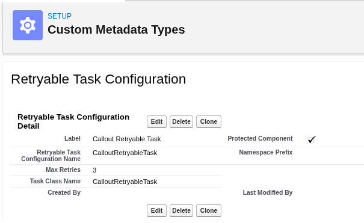
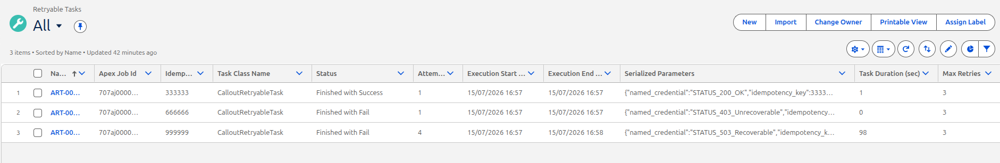
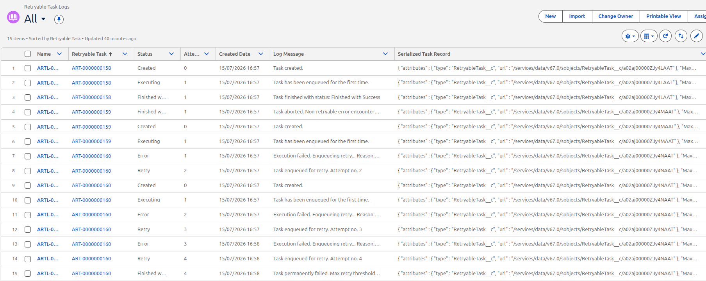

# How to use the framework

Ok, so far, so good. I think I have explained what the framework does, what are the pieces, as well as what are their responsibilities.<br>

Now, if one wishes to use it, what should be done?<br>
Lets continue to pretend that we have the use case

> Send a quotation request to an external system with some product and customer data.

**1.** The first step would to implement the concrete task class.<br>
I decided to do this within a class example named CalloutRetryableTask.<br>
Be aware to keep best practices in mind and use NamedCredentials for the callout.

```java
public class CalloutRetryableTask extends AbstractRetryableTask {

    public override void process(QueueableContext context) {
        Http http = new Http();
        HttpRequest request = new HttpRequest();
        request.setHeader('Content-Type', 'application/json');
        request.setHeader('Accept', 'application/json');
        request.setMethod('POST');
        request.setBody(JSON.serialize(params));
        try {
            ConnectApi.NamedCredential namedCredential =
                ConnectApi.NamedCredentials
                  .getNamedCredential('QUOTATION_SERVICE_NC');
            request.setEndpoint('callout:' + namedCredential.developerName);
            HttpResponse response = http.send(request);
            if (response.getStatusCode() != 200) {
                throw new RetryableTaskException(response.getStatus());
            }
        } catch (Exception ex) {
            throw new RetryableTaskException(ex.getMessage());
        }
    }

    public override String getIdempotencyKey() {
        return this.parameters.get('idempotency_key').toString();
    }
}
```

The parameters map can be used to pass the customer and products data. This map is defined in the abstract class and is accessible for the integration application.<br>

As you can see above, the idempotency key is just been read from the parameters map.<br>
It is also being passed from outside, but it should be properly calculated.<br>
That means implementing key = f (action, user, data) so that the key represents unique and properly the request being fired.

**2.** After creating the concrete class. The respective Custom Metadata Type record must be configured.

<div align="center">
  
  <p><i>RetryableTaskConfiguration__mdt record for the Callout task</i></p>
</div>

**3.** Finally, the task must be instantiated and enqueued for execution in your integration code. This is how it is done.

```java
RetryableTaskConfiguration__mdt config =
    RetryableTaskConfiguration__mdt
      .getInstance('CalloutRetryableTask');
AbstractRetryableTask quotationTask = RetryableTaskManager.createTask(
    config,
    new Map<String, Object>{
      'idempotency_key' => 666666,
      'customer' => { customerId: 123456, ...},
      'products' => [
        { productId: 123456, ...},
        { productId: 123467, ...},
        { productId: 123478, ...}
      ]
    }
);
RetryableTaskManager.enqueueTask(quotationTask);
```

So this is all to be done.<br>

After doing some tests (see scripts/apex/anonymous-test-framework.apex in Git Repository), with endpoints returning 200, 403 and 503 responses, I could see the results as expected.

<div align="center">
  
  <p><i>Retryable Task records</i></p>
</div>
<div align="center">
  
  <p><i>Retryable Task Log records</i></p>
</div>

<br>

[<< BACK](../README.md)
